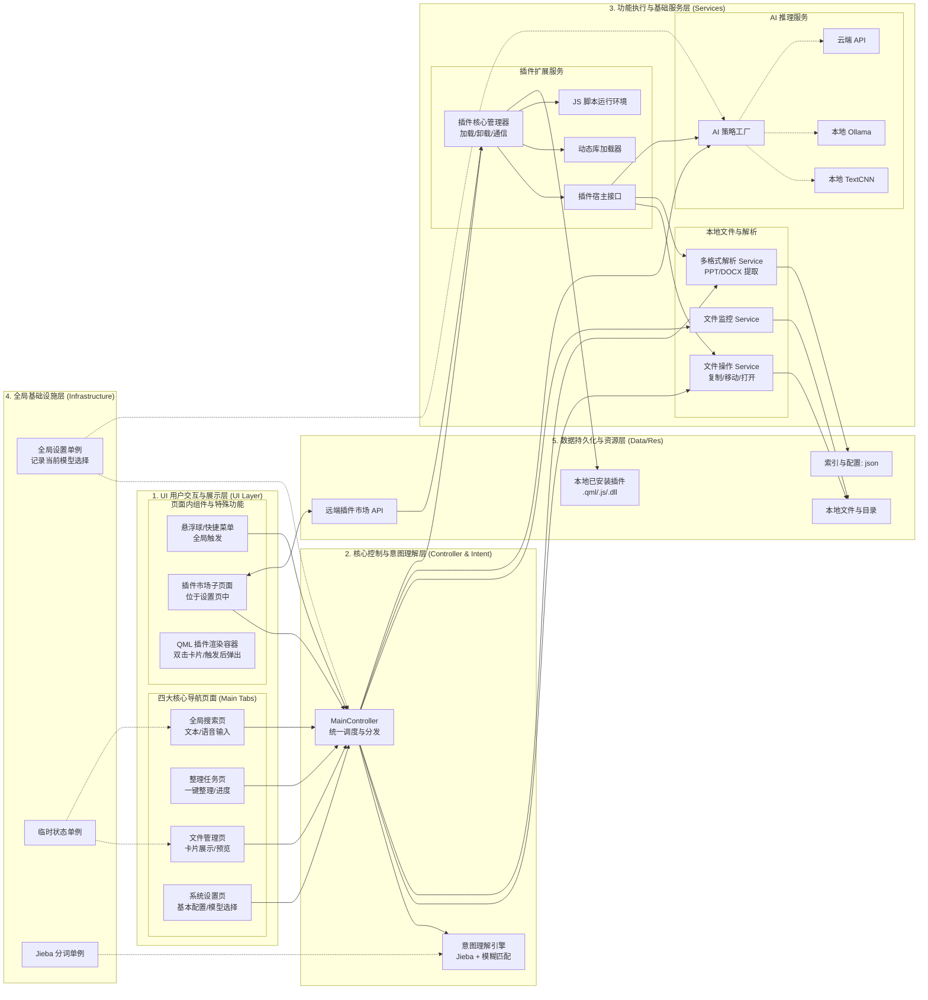
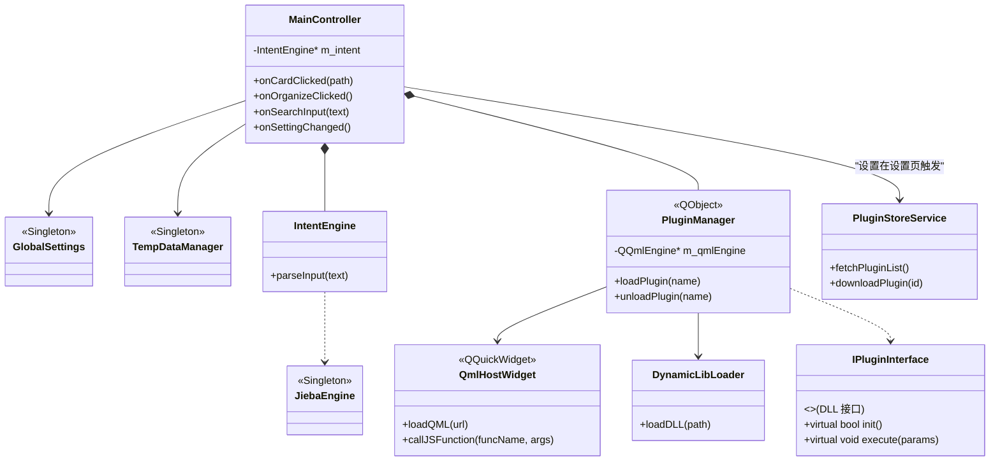
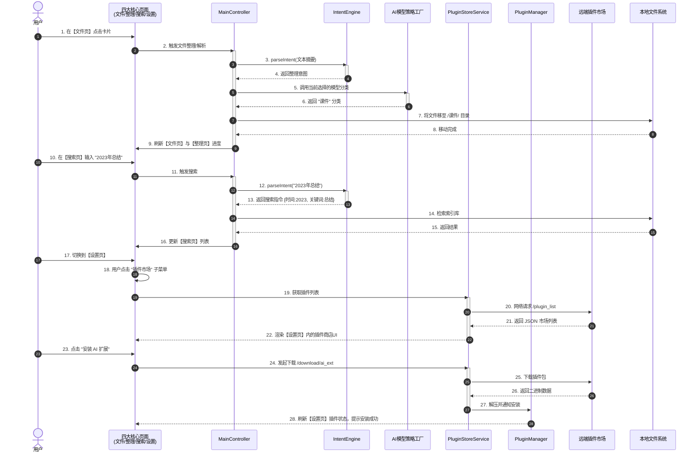
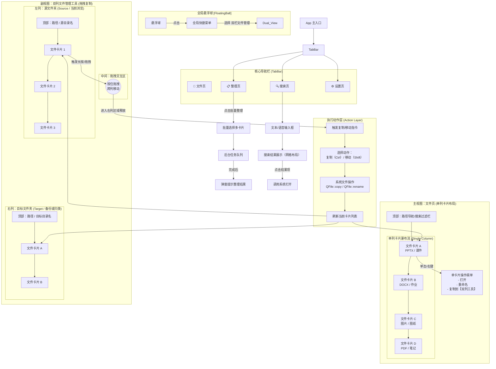

# ClassAssistant 班级助手

### 设计功能
- [ ] 课件整理（主要）
- [ ] 课件分类以及复制等快捷使用的功能
- [ ] 小组件（随机数 等）（插件形式 + 插件市场）
- [ ] 语音识别
- [ ] 班级管理相关功能（待确定）
- [ ] 其它功能

### 使用的第三方库
- [Fluent-Qt](https://github.com/calvinhxx/Fluent-Qt)
- onnxruntime
- [cppjieba](https://github.com/yanyiwu/cppjieba)
- [docxcpp](https://github.com/yunxingluoyun/docxcpp)
- [pptx-reader](https://github.com/huanhuan0812/pptx-reader)
- vosk api
- tessract api
- Qt

### 架构图
- ##### 设计架构

- ##### c++ 类结构

- ##### 时序

- ##### ui
